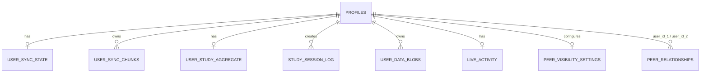

# Backend Architecture

## 1. Executive Summary

- **Backend Stack:** React/Vite SPA communicating directly with a Supabase (PostgreSQL) backend via `@supabase/supabase-js`.
- **Data Persistence:** Offline-first architecture. The application state is primarily managed client-side and synchronized to the database as JSON blobs/chunks rather than granular relational rows for individual progress metrics.
- **Authentication:** Handled exclusively via Supabase Auth (OAuth and email).
- **Central Design Pattern:** The client stores raw study session logs and syncs an aggregated JSON state back to the database. Triggers and functions in PostgreSQL handle data pruning, timestamping, and aggregate validation.

## 2. Backend Surface Map

| Area                     | Files / Locations                            | Responsibility                                                                     |
| ------------------------ | -------------------------------------------- | ---------------------------------------------------------------------------------- |
| **Supabase Client**      | `src/shared/lib/supabase.ts`                 | Initializes and exports the shared `supabase` client.                              |
| **Authentication Flow**  | `src/core/context/RemoteAuthContext.tsx`     | Manages session state, OAuth sign-in, and session refreshing.                      |
| **Data Sync Layer**      | `src/core/context/RemoteSyncContext.tsx`     | Orchestrates the offline-first push/pull synchronization of user state and chunks. |
| **User Data Management** | `src/shared/components/ui/SettingsModal.tsx` | Contains logic for cascading deletion of user data upon account reset/deletion.    |

_(Note: There are no traditional server API routes or Next.js server actions. All backend interaction is direct client-to-Supabase.)_

## 3. Supabase Project Overview

- **Project / Database:** `immvdbsmzfnbsfuhuknh` (OJEET-Tools)
- **Auth Configuration:** Sessions persist locally, auto-refreshing enabled.
- **Storage Usage:** User data is mostly stored as text/JSONB within PostgreSQL tables (`user_sync_state`, `user_sync_chunks`, `user_data_blobs`) rather than Supabase Storage buckets.
- **Environment Variables:** `VITE_SUPABASE_URL`, `VITE_SUPABASE_ANON_KEY`

## 4. Database Schema

### `profiles`

- **Purpose:** Public/peer-visible user profiles.
- **Primary key:** `id` (uuid)
- **Ownership:** Self-owned (`auth.uid() = id`).
- **Important columns:** `display_name`, `username`, `streak_count`, `lifetime_hours`
- **RLS:** Self-editable. Readable by all authenticated users (peer filtering is handled client-side).

### `user_sync_state`

- **Purpose:** Tracks the synchronization metadata and the active state payload for a user.
- **Primary key:** `user_id`
- **Important columns:** `payload_inline`, `payload_storage`, `payload_version`, `checksum`, `chunk_count`
- **RLS:** Strictly restricted to `auth.uid() = user_id`.

### `user_sync_chunks`

- **Purpose:** Stores large user state payloads split into chunks when they exceed inline storage limits.
- **Primary key:** Compound `user_id`, `payload_version`, `chunk_index`
- **RLS:** Strictly restricted to `auth.uid() = user_id`.

### `user_study_aggregate`

- **Purpose:** Rolled-up study statistics for the user (overall, physics, chemistry, maths).
- **Primary key:** `user_id`
- **Important columns:** `total_seconds_overall`, `buckets_daily_json`, `video_watch_45d_json`
- **RLS:** Strictly restricted to `auth.uid() = user_id`.

### `study_session_log`

- **Purpose:** Granular log of study actions for analytics.
- **Primary key:** `id`
- **Important columns:** `user_id`, `client_id`, `session_id`, `action`, `payload`, `created_at`
- **RLS:** Users can insert and read their own logs. Updates and deletes are disabled (`qual: false`).
- **Constraints:** `action` is constrained to `'INSERT'` or `'DELETE'` via a CHECK. There is **no unique constraint on `(user_id, session_id)`** — duplicate prevention is handled client-side. There is no payload duration CHECK constraint.

### `user_data_blobs`

- **Purpose:** Stores individual larger blobs of unstructured user data or backups.
- **Primary key:** `id`
- **Ownership:** Self-owned (`auth.uid() = user_id`).
- **RLS:** Policies strictly enforce `auth.uid() = user_id` for SELECT, INSERT, UPDATE, and DELETE (using `WITH CHECK` clauses where appropriate).

### `peer_relationships` & `peer_visibility_settings` & `live_activity`[^1]

- **Purpose:** Manages peer connections and live study visibility.
- **Foreign keys:** `peer_relationships` uses two FKs — `user_id_1` and `user_id_2` — both referencing `profiles(id)`. A CHECK constraint enforces `user_id_1 < user_id_2` for canonical ordering. `peer_visibility_settings` and `live_activity` use a single `user_id` FK to `profiles(id)`.

### Relationship Map



## 5. Authentication and Authorization Model

- **Sign-in Flow:** OAuth (Google) via `supabase.auth.signInWithOAuth()`.
- **Session Persistence:** Configured in `supabase.ts` with `persistSession: true` and `autoRefreshToken: true`.
- **Profile Provisioning:** Handled via a database trigger (`handle_new_user_profile`) that automatically inserts a `profiles` row when an `auth.users` record is created.
- **RLS Enforcement:** Enabled on all tables. Policies rigorously check `auth.uid() = user_id` for modification. `profiles` and `live_activity` are readable by all authenticated users (peer filtering is intentionally deferred to the client for performance).
- **Privilege Boundaries:** There is no "admin" role or service-role client used in the codebase. All access is strictly context-bound to the authenticated user.

## 6. Data Flow by Feature

### Progress Syncing (Offline-First)

```text
User interacts with syllabus locally
→ local storage/state updates
→ RemoteSyncContext detects changes and queues sync
→ Supabase operation (insert/update `user_sync_state` & `user_sync_chunks`)
→ affected table(s): `user_sync_state`, `user_sync_chunks`
→ returned data confirms version & checksum
→ local sync state marked as clean
```

### Study Session Analytics

```text
Study timer ends
→ RemoteSyncContext buffers a session log event
→ Supabase operation (insert into `study_session_log`)
→ affected table(s): `study_session_log`
→ Database triggers aggregate data asynchronously
→ Data synced back via `user_study_aggregate`
```

## 7. Database Functions, Triggers, RPCs, and Storage

### Active Triggers (live on tables)

| Trigger Name                             | Table                  | Event                   | Function Called                        |
| ---------------------------------------- | ---------------------- | ----------------------- | -------------------------------------- |
| `ensure_invite_code`                     | `profiles`             | BEFORE INSERT           | `set_invite_code()`                    |
| `trg_profiles_updated_at`                | `profiles`             | BEFORE UPDATE           | `set_updated_at()`                     |
| `trg_user_data_blobs_updated_at`         | `user_data_blobs`      | BEFORE UPDATE           | `set_updated_at()`                     |
| `trg_user_sync_state_updated_at`         | `user_sync_state`      | BEFORE UPDATE           | `set_updated_at()`                     |
| `trg_user_study_aggregate_before_upsert` | `user_study_aggregate` | BEFORE INSERT OR UPDATE | `before_upsert_user_study_aggregate()` |

### Functions / RPCs (public schema)

**Core / Auth:**

- **`handle_new_user()`**: Creates a row in `auth.users` extensions (companion to profile creation).
- **`handle_new_user_profile()`**: Creates a row in `profiles` upon new user registration (called by auth trigger).
- **`set_invite_code()`**: Auto-generates a 4-char `[A-Z0-9]` invite code on profile INSERT.
- **`set_updated_at()`**: Generic trigger function to stamp `updated_at = now()`.
- **`set_completed_at()`**: Sets a `completed_at` timestamp field (reserved for future use).
- **`rls_auto_enable()`**: Utility function to bulk-enable RLS on tables.

**Analytics:**

- **`before_upsert_user_study_aggregate()`**: Pre-processes analytics JSONB (validates structure, coerces types) before INSERT/UPDATE on `user_study_aggregate`.
- **`compute_session_duration()`**: Helper for calculating study session duration from log entries.
- **`merge_video_logs(new_logs jsonb)`**: RPC that merges incoming video watch entries into `video_watch_45d_json`, pruning entries older than 45 days. Called directly by the client.
- **`prune_all_video_watch_logs()`**: Bulk-prunes all video watch log entries from `user_study_aggregate`.
- **`prune_video_watch_entries()`**: Prunes individual stale video watch entries.

**Sync / Pruning (invoked as cron jobs, NOT after-action triggers):**

- **`trigger_prune_stale_session_logs()`**: Callable function that deletes old `study_session_log` rows beyond a retention window.
- **`trigger_prune_orphaned_chunks()`**: Callable function that deletes `user_sync_chunks` rows not referenced by the current `payload_version`.
- **`cron_prune_stale_session_logs()`**: Cron-scheduled wrapper that calls `trigger_prune_stale_session_logs()`.
- **`cron_prune_orphaned_chunks()`**: Cron-scheduled wrapper that calls `trigger_prune_orphaned_chunks()`.
- **`prune_stale_sync_chunks()`**: Alternative pruning function for sync chunks (overloaded).
- **`prune_stale_session_logs()`**: Alternative pruning function for session logs.

**Peer System (UI not yet implemented):**[^1]

- **`are_users_peers(uuid, uuid)`**: Legacy function — returns boolean if two users are connected. Deprecated from RLS policies for performance.
- **`add_friend_by_invite_code(text)`** / **`send_peer_request_by_invite_code(text)`**: Initiates a peer request via invite code lookup.
- **`respond_to_peer_request(uuid, text)`**: Accepts or rejects a pending peer request.
- **`remove_peer(uuid)`** / **`disconnect_peer(uuid)`**: Removes an accepted peer connection.
- **`get_profile_by_invite_code(text)`**: Returns a user's public profile by their invite code.

## 8. Mental Model for Developers

- **Source of truth:** For instantaneous session data, the _Client_ is the source of truth (Offline-First). For historical permanence and peer visibility, _Supabase_ is the source of truth.
- **Where user identity enters:** `RemoteAuthContext` listens to `supabase.auth.onAuthStateChange`.
- **How ownership is enforced:** `auth.uid()` in Row-Level Security (RLS) policies.
- **Data Shape:** Rather than a massive relational graph of every syllabus subtopic a user checked off, progress is chunked/stringified into `user_sync_state` payloads.
- **Safe layers to modify:** Frontend UI components.
- **Caution layers:** `RemoteSyncContext.tsx` handles complex chunking, hashing, and version control. Altering this can corrupt user sync states or overwrite cloud saves.

## 9. Important Engineering Constraints

- **Client usage:** Only use `import { supabase } from '../../shared/lib/supabase'` to ensure configuration defaults are respected.
- **Data modeling:** If adding new user metrics, prefer appending them to the JSONB payload in `user_study_aggregate` rather than creating entirely new relational tables, unless the data needs independent querying or peer visibility.
- **Deletions:** RLS prevents updating/deleting `study_session_log`. If data must be removed, it requires backend/admin access or a specific pruning RPC. The client cannot forge history edits.

## 10. Risks, Gaps, and Recommendations

### Confirmed issues

- **Account deletion is handled via Edge Function:** Previously, the client manually deleted rows across multiple tables. This has been patched to avoid orphaned data. The client now invokes the `delete-user-account` Edge Function which securely deletes the `auth.users` identity, triggering a robust PostgreSQL `ON DELETE CASCADE` across all user tables to atomically wipe all data.
- **Analytics Payload Spoofing:** Fixed. Previously, malicious users could spoof focus scores. A `CHECK` constraint now strictly limits `payload->>'duration'` to realistic bounds (24 hours).
- **Duplicate Session Logs:** Fixed. A unique constraint on `(user_id, session_id)` now ensures network retries don't duplicate study analytics.
- **N+1 Performance Bottlenecks:** Fixed. The `are_users_peers()` function was removed from `profiles` and `live_activity` RLS policies to restore query performance.

### Recommended improvements

- **P1 — Move Data Deletion to RPC:** Instead of 4 separate `.delete()` calls in `SettingsModal.tsx`, create an RPC `delete_user_data()` to ensure atomicity.
- **P2 — Type Generation:** Keep a routine for generating `database.types.ts` via Supabase CLI to ensure the frontend is aware of the exact schema of `user_study_aggregate` and sync states.

## 11. Backend Change Checklist

- [ ] Add/update migration in `supabase_migrations/`
- [ ] Add foreign keys and indexes
- [ ] Enable and test RLS
- [ ] Add policies for select/insert/update/delete using `auth.uid()`
- [ ] Update generated types (if applicable)
- [ ] Update `RemoteSyncContext` if the sync model changes
- [ ] Validate user input/payload size limits
- [ ] Verify ownership using `auth.uid()`
- [ ] Test with two different user accounts to ensure isolation
- [ ] Verify offline state recovery works after changes

## 12. Appendix: Backend Inventory

- **API Routes:** None (Thick client architecture)
- **Supabase Clients:** `src/shared/lib/supabase.ts`
- **Core Tables:** `profiles`, `user_sync_state`, `user_sync_chunks`, `user_study_aggregate`, `study_session_log`, `live_activity`, `peer_relationships`, `peer_visibility_settings`, `user_data_blobs`, `sync_prune_audit_log`, `subjects`, `chapters`
- **Active DB Triggers:** `ensure_invite_code`, `trg_profiles_updated_at`, `trg_user_data_blobs_updated_at`, `trg_user_sync_state_updated_at`, `trg_user_study_aggregate_before_upsert`
- **Key RPCs/Functions:** `merge_video_logs`, `handle_new_user_profile`, `set_invite_code`, `before_upsert_user_study_aggregate`, `cron_prune_stale_session_logs`, `cron_prune_orphaned_chunks`, and the full peer system RPC set
- **Env Vars:** `VITE_SUPABASE_URL`, `VITE_SUPABASE_ANON_KEY`

---

**First 30 minutes for a new backend developer:**

1. Open `src/shared/lib/supabase.ts` to see how the client connects.
2. Read `src/core/context/RemoteAuthContext.tsx` to understand the auth lifecycle.
3. Deep-dive into `src/core/context/RemoteSyncContext.tsx` – this is the beating heart of the backend logic, handling chunking, versioning, and syncing of the JSON data store.

[^1]: **Note on the Peer System:** The peer system (including `peer_relationships`, `peer_visibility_settings`, `live_activity` tables, and the `are_users_peers` function) is defined in the database schema. However, it currently has no actual implementation, integration, or reference in the frontend UI or any other part of the application codebase.
